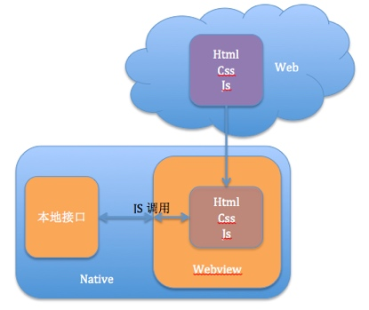
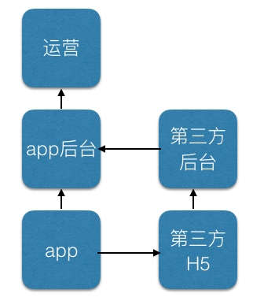

# H5与native之间的通信

## 概述

为什么要实现H5与native之间的通信？
H5标准2014年底才正式完成，而且webkit是阉割版的browse，各平台的支撑力度又不同。所以要实现H5调用系统特性，尤其是调用业务相关接口，只能自己实现H5与native的相互接口调用。

H5与native之间的桥梁是javascript解释器，webkit中就是javascriptCore了。在ios7没出来之前，苹果是不开放javascriptCore接口的，只能通过有限的资源另辟蹊径，曲线救国。


## 框架



上图是H5与native之间交互的简单框架图。

实现的关键有两点：
1. 实现本地接口供js调用，实现js接口供本地接口调用
2. 实现js与本地接口互相调用的桥梁

这里我们着重讨论第2点。webview在ios、wp、android上均有执行js的方法，那么本地接口调用js方法就有了。js调用本地方法就要麻烦一些，因为要考虑夸平台。

* android可通过javascriptCore方式直接调用
* wp可通过window.external.notify的方式调用
* ios可通过location方式调用

下来就开始整合js sdk。实现跨平台调用就要遵循最小原则，即ios通过location调用传参，那么所有参数均转换为字符串处理，因为本地对json支撑都没有问题，传输格式采用json。

为了调用者方便，js sdk内部封装字符串与对象之间的转换：

```javascript
O2String:function(O) {
	var S = [];
	var J = "";
	if (Object.prototype.toString.apply(O) === '[object Array]') {
		for (var i = 0; i < O.length; i++)
			S.push(O2String(O[i]));
		J = '[' + S.join(',') + ']';
	}
	else if (Object.prototype.toString.apply(O) === '[object Date]') {
		J = "new Date(" + O.getTime() + ")";
	}
	else if (Object.prototype.toString.apply(O) === '[object RegExp]' || Object.prototype.toString.apply(O) === '[object Function]') {
		J = O.toString();
	}
	else if (Object.prototype.toString.apply(O) === '[object Object]') {
		for (var i in O) {
			
			var tmp = typeof (O[i]) == 'string' ? '"' + O[i] + '"' : (typeof (O[i]) === 'object' ? O2String(O[i]) : O[i]);
			S.push('"' + i + '"' + ':' + tmp);
		}
		J = '{' + S.join(',') + '}';
	} else if (Object.prototype.toString.apply(O) === '[object Number]') {
		J = O.toString();
	} else if (Object.prototype.toString.apply(O) === '[object String]') {
		J = O ;
	}
	return J;
}
```

各平台js调用封装：

```javascript
invokeMobile:function(obj, cb) {
	var arg = fashion.O2String(obj);
	fashion.last_cmd = "invokeMobile" + arg;
	fashion.user_call_back = cb;
	var u = navigator.userAgent;
	if (u.indexOf('Android') > -1 || u.indexOf('Linux') > -1) {
		javascript:sdkInterface.enteryMobile(arg);
	}
	else if(!!u.match(/\(i[^;]+;( U;)? CPU.+Mac OS X/)) {
		document.location = "mobileFunc:" + arg;
	}
	else if(u.indexOf('IEMobile') > -1) {
		window.external.notify(arg);
	} else {
		fashion.error_reason = "other browse";
		return;
	}
}
```

另外为了独立交互层和业务层，业务接口独立，还需要考虑一点是js sdk是集成到客户端内部还是放在公网上让第三方引用，考虑到版本一致性，我们最后还是放到了公网上。从结果来看，业务接口独立和js sdk引用源是正确的。


## 会话

下面需要考虑会话问题，如果js sdk只用于自己的H5使用，那么会话很好控制，如果要承载第三方H5页，则存在双方会话同步问题。

客户端有30分钟会话失效时间，用户操作时会更新会话，一旦进入第三方H5页，也就进入第三方会话控制中，我方无法控制。解决方法是，进入第三方H5页，让第三方后台给我方后台会话报活。

## 安全




运营平台可以做安全控制，其他环节必须做安全校验，网络通信采用https协议，js接口调用可以采用appkey之类的做校验。

## 总结

location调用传参会有很多限制，ios7之后开放javascriptCore接口，给js bridge带来很大好处，可以脱离webview独立使用，js接口也可以写的更简单优雅。

除了自己做js bridge外，还有很多第三方库使用，如cordova，react native和其他js bridge库。无论哪种方式，核心思想是不变的，不同的库所针对的问题也不同，可根据项目需要选择对应的库。

在线升级部署在ios侧还没有成熟的解决方案，原因在于官方没有开放二进制运行加载（当然，官方永远不可能开放）。所以大部分方案都采用曲线方式，但无论哪种方式，只能承载app的部分功能，整个app完全采用js方式，假如是外包项目可以尝试，产品嘛就算了。


## 

