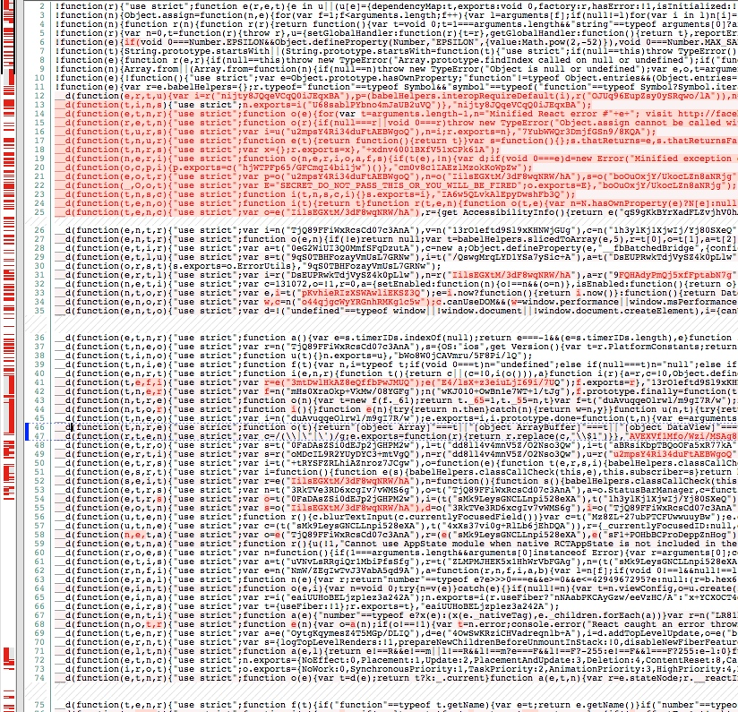
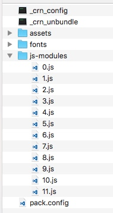
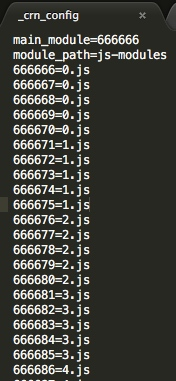
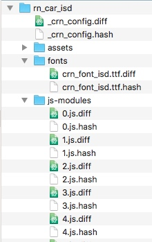
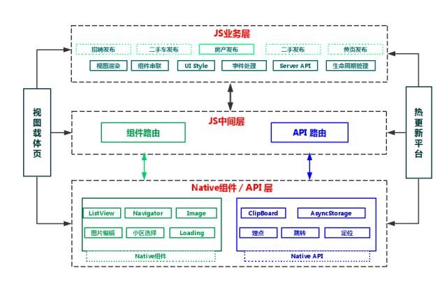
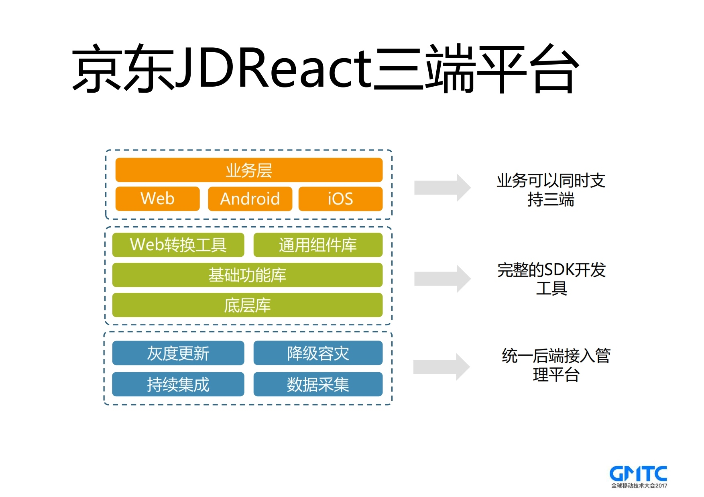
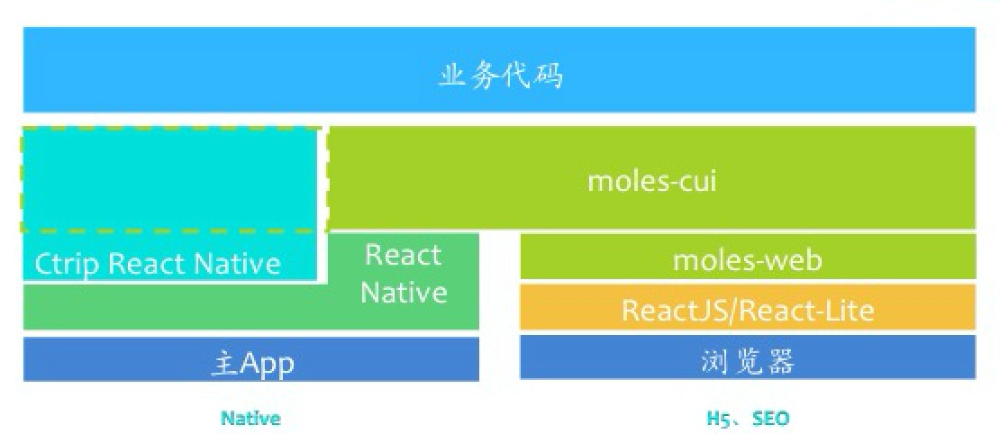

# React Native增量更新竞品分析

## 京东

RN版本控制接口：

https://106.39.169.231/client.action?functionId=getReactNativeVersion

请求报文中有核心字段`body`：

```
"local": { 
        "JDReactJingXuan": "1.2", 
        "JDReactNewProduct": "1.2", 
        "JDReactPaySuccess": "1.1", 
        "JDReactCommon": "1.0", 
        "JDReactTicketBooking": "1.1", 
        "JDReactGuessBall": "1.0", 
        "JDReactShopTemplate": "1.0", 
        "JDReactAfterSales": "1.0", 
        "JDReactGamePropBuy": "1.0", 
        "JDReactLivingPayRecords": "1.1", 
        "JDReactCardPwd": "1.0", 
        "JDReactCardPwdBuy": "1.1", 
        "JDReactHelpCenter": "1.0", 
        "JDReactCollectJDBeans": "1.6", 
        "JDReactShanGou": "1.0", 
        "JDReactShopMine": "1.0", 
        "JDReactFlowStation": "1.0", 
        "JDReactLivingPay": "1.0", 
        "JDReactFlightOrderDetail": "1.3", 
        "JDReactShopSignRankList": "1.0", 
        "JDReactLivingPayOrderDetail": "1.0" 
    } 
```

响应报文：

```
"result": [{ 
        "zipPath": "https://storage.jd.com/reactzip/temp/JDReactNewProduct_20170727152319.zip?Expires=2131860199&AccessKey=e42533f42e13bee9a009863f567524e250ce43ae&Signature=%2BMCLx%2F2WuQph5uvOfK5Xl9oio7c%3D", 
        "isNeed": true, 
        "versionCode": "1.3", 
        "moduleCode": "JDReactNewProduct" 
    }, { 
        "zipPath": "https://storage.jd.com/reactzip/temp/JDReactCardPwdBuy_20170720193753.zip?Expires=2131270673&AccessKey=e42533f42e13bee9a009863f567524e250ce43ae&Signature=vfPWHulmG6PSuMHkRpL7W%2FoBKgQ%3D", 
        "isNeed": true, 
        "versionCode": "1.2", 
        "moduleCode": "JDReactCardPwdBuy" 
    }, { 
        "zipPath": "https://storage.jd.com/reactzip/temp/JDReactJingXuan_20170801142922.zip?Expires=2132288962&AccessKey=e42533f42e13bee9a009863f567524e250ce43ae&Signature=pgFj37pJrmN5ULnhFpuo4cLNxWQ%3D", 
        "isNeed": true, 
        "versionCode": "1.4", 
        "moduleCode": "JDReactJingXuan" 
    }, { 
        "zipPath": "https://storage.jd.com/reactzip/temp/JDReactSizeHelper_20170801154257.zip?Expires=2132293377&AccessKey=e42533f42e13bee9a009863f567524e250ce43ae&Signature=%2BZP1g6ucLPgXP2lCgKk0tI6GoF8%3D", 
        "isNeed": true, 
        "versionCode": "1.1", 
        "moduleCode": "JDReactSizeHelper" 
    }, { 
        "zipPath": "https://storage.jd.com/reactzip/temp/JDReactCollectJDBeans_20170808155403.zip?Expires=2132898843&AccessKey=e42533f42e13bee9a009863f567524e250ce43ae&Signature=Dk%2B2TPpf7MLsXtM80YrwE3v9xQU%3D", 
        "isNeed": true, 
        "versionCode": "1.7", 
        "moduleCode": "JDReactCollectJDBeans" 
    }] 
```

请求中是App中已有的RN模块及相对应的版本号，后台返回有更新的RN模块、版本号以及下载路径。京东按照业务模块分多个jsbundle。

我们下载一个RN模块看下它的内部结构：


解压后发现目录结构为：资源、jsbundle、version、meta。其中meta是二进制文件，暂不清楚干什么用。

version文件内容：

```
{ 
  "moduleName":"JDReactCollectJDBeans”,    //业务模块名称 
  "moduleCode":"1.7",                      //业务模块版本号                   
  "targetAppVersion":"5.5.0",              //App版本 
  "frameworkVersion":"0.45.1",             //RN版本号 
  "platform":"ios"                         //系统平台 
} 
```

在请求字段中的模块有个`JDReactCommon`，用来做RN框架公共部分基础包，其他业务包和该基础包合并就是完整的jsbundle，因此京东为jsbundle做了基础拆分。

然而，看下业务包的大小：


可以看到，压缩后的业务包依然很大。

再来看下，随意两个业务包的文件对比：



可以看出业务包之间的重复代码量很大。由此可以得出结论，京东对jsbundle做了框架包、业务包的拆分，但业务包依然很大，业务包中的代码冗余没有再做拆分。

再看下京东对资源的处理，资源目录下只有资源图片，没有其他文件，版本接口中也未有资源相关控制字段。由此可以猜测出，京东对资源处理有两种方式：

1. 资源全量覆盖，没有做资源增量处理。
2. 只做了资源新增、资源替换的增量处理，没有做删除资源处理。


## 58同城

58的RN版本控制接口比较简单，直接在get请求中给出bundleid、app版本和系统平台：

https://app.58.com/api/base/hotupdate/getresource?bundleid=7&appversion=7.12.1&os=ios&commver=7&ver=7

响应报文：

```
{ 
    "common_patch": {}, 
    "is_app_force_update": false, 
    "is_rnpage_force_update": false, 
    "ver": 89, 
    "url": "https://a.58cdn.com.cn/app58/rnpatch/online/69d030798d1fce496f3fa220e67c0756.zip" 
} 
```

根据`common_patch`字段以及增量包的分析猜测，58也做了框架包与业务包的拆分，框架包可以独立更新，58只有一个业务包，RN应用没有京东广泛。业务包中只有jsbundle，没有其他文件，因此jsbundle的版本通过接口控制，如`"ver": 89`。

## 淘宝


抓包只看到weex的应用，没有见到RN的影子。同时可以看到淘宝中大量应用了webapp。

## 携程

携程的RN版本控制接口是：

https://m.ctrip.com/restapi/soa2/12378/json/gepackages

请求字段：

```
{ 
    "dataVersion": 0, 
    "requestedOnly": false, 
    "originalDataVersion": 0, 
    "buildId": "3493018", 
    "requestHybirdPKGList": [{ 
        "hybridPackageInfoID": 192696, 
        "productCode": "ship", 
        "newestHybridPackageInfoID": 196784 
    }, { 
        "hybridPackageInfoID": 108499, 
        "productCode": "landing", 
        "newestHybridPackageInfoID": 108499 
    }, { 
        "hybridPackageInfoID": 188787, 
        "productCode": "airportbus", 
        "newestHybridPackageInfoID": 196382 
    },

	  ...

```

响应字段：

```
"hybridPackageList": [{ 
        "productId": 163, 
        "pkgURL": "http://download2.ctrip.com/html5/themetravel_706.000_183510_197090_a345d656-811d-4cc0-a653-86a1d3936c1e.zip", 
        "priorityLeve": 100, 
        "dataVersion": 24583, 
        "productCode": "themetravel", 
        "size": 2224, 
        "packageType": "Hybrid", 
        "signCode": "QrIg9hC5IwXNBnTv6qjNWrWCNY6VxRkUl3yEUS5jqacAk27qERnpp9AkL8+zTckdjZFJFsd3LW5C\nuRB/+1WuZgjfu0vy/i0vvsdgmkSb5NKjImXoI14Bt68eKN9niY9s+kqWlHxe/MhGPAFJVFpOd3PI\nmHkHtqKcjTikqQdwkms=\n", 
        "description": "", 
        "isForce": false, 
        "packageID": "20170809140341P334", 
        "productName": "度假主题游", 
        "increFlag": 1, 
        "hybridPackageInfoID": "197092" 
    }, { 
        "productId": 295, 
        "pkgURL": "http://download2.ctrip.com/html5/rn_hotelReservation_3502017_706.0.zip", 
        "priorityLeve": 100, 
        "dataVersion": 24526, 
        "productCode": "rn_hotelReservation", 
        "size": 129508, 
        "packageType": "ReactNative", 
        "signCode": "R/ODvpj6f34+Gs3S9qPkjcR2xE9sZOFhOaTYOP55eFFxm2oLu7LjpcpjV7FqbDTJ90HFJPTy2Y2i\nV2iVd9VR2TgY3NQmPvg7fs11EkPxd+3M7obsD0B7XTGNJFvX3b/cKcfzW+XNrF3GWM/rqCvxbCkA\n7+QRO7tknbbR9ybHrvI=\n", 
        "description": "", 
        "isForce": false, 
        "packageID": "20170808195759P897", 
        "productName": "酒店订单详情页", 
        "increFlag": 0, 
        "hybridPackageInfoID": "196909" 
    }, 

	 ...
```

携程的RN版本控制与webapp的版本控制是一个接口，通过`packageType`区分类型。同时请求中有个productCode为`rn_common`的字段，说明携程也做了框架包与业务包的拆分。

更新包目录：



```
_crn_config  //业务包描述文件
_crn_unbundle //打包标识文件
assets        //资源文件
fonts         //字体文件
js-modules    //业务代码
```

js-modules中一堆js文件是什么？它是RN的unbundle命令打出来的包，文件名是main.jsbundle中定义的独立模块索引：


不过携程对其重新加工了一番，因为js文件太多，就对js再次合并，合并的规则使用config文件描述。

_crn_config文件格式：



	1	main_module为当前业务模块入口模块ID；
	2	module_path为业务模块JS文件所在当前包的相对路径；
	3	666666=0.js,说明666666这个模块在0.js文件里面；

虽然对业务代码进行了拆分，但只是为了RN加载优化，业务代码体积并没有减少。在看另一个RN增量模块，对每个js模块都进行了差异比较，这样即做到了框架增量又做到了业务增量。




## 结论

1. 58的处理方式比较简单，针对一个RN入口的app来说比较合适，实现工作量及增量包大小都比较合理。
2. 京东对多业务入口情况进行RN包的拆分，但只拆分了框架包和业务包，业务包之间的重复代码依然较多。
3. 携程的拆包方案最复杂，定制化较多，主要针对RN加载性能做出的拆包方案。


## 各平台RN应用架构

58架构：



京东架构：




携程架构：




