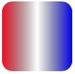
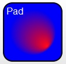
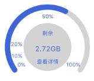

# SVG 基础及码表动画实现

## 位图和矢量图形

位图是将图像的所有像素信息进行记录，而矢量图形只记录形成图像的公式，渲染时才进行像素计算。因此，一般位图的文件大小比矢量图形大。

位图可以记录非常复杂的图像信息，而矢量图形记录相对有限；位图缩放会影响图像的质量，但矢量图形不会，两者各有优点。


## SVG包含哪些内容

SVG包含基本形状、渐变、常用滤镜和动画，使用描述性语言xml来表述图形。

react-native-svg是react-native第三方库，目前还不支持滤镜及内置动画。为描述方便，下文提及SVG均指react-native-svg。

## SVG基本形状和公共属性

基本形状：

	·	矩形 <rect>
	·	圆形 <circle>
	·	椭圆 <ellipse>
	·	线 <line>
	·	折线 <polyline>
	·	多边形 <polygon>
	·	路径 <path>
	·	文本 <text>
	

通过这些基本形状的组装变化，可以繁衍出更复杂的形状。

公共属性：

	·	fill 形状的填充色
	·	fillOpacity 形状的透明度
	·	stroke 外边框颜色
	·	strokeWidth 外边框的宽度
	·	strokeOpacity 外边框的透明度
	·	strokeLinecap 外边框端点的样式
	·	strokeLinejoin 外边框拐角线的样式
	·	strokeDasharray 外边框虚线和间隔的样式
	·	strokeDashoffset 外边框虚线的间隔
	·	x 横坐标
	·	y 纵坐标
	·	rotate 旋转角度
	·	scale 缩放
	·	origin 当前对象的基坐标
	·	originX 当前对象的基坐标X
	·	originY 当前对象的基坐标Y
	
基本示例：

```
<Rect x="20" y="20" width="75" height="75"/>
```


## SVG渐变

渐变是一种从一种颜色到另一种颜色的平滑过渡。

SVG支持两种变换：`线性变换`和`放射性变换`。

线性渐变：



放射性渐变：




## SVG事件

svg基本形状均支持以下事件：

	•	disabled
	•	onPress
	•	onPressIn
	•	onPressOut
	•	onLongPress
	•	delayPressIn
	•	delayPressOut
	•	delayLongPress
	
	
## 动画

SVG没有内置动画属性，因此动画效果需要手动实现（手动需要每次重新绘制SVG组件，因此性能上先天不足）。

## SVG路径元素path

path是SVG基本形状中最强大的一个，它不仅能创建其他基本形状，还能创建更多其他形状。但是使用起来没有直接使用其他形状简单直接，只有在基本形状无法满足的情况下，才考虑使用path。

```svg
示例：
<path d="M250 150 L150 350 L350 350 Z" />
```

path有个重要的属性`d`，其属性值是一系列操作路径的命令，格式为`命令+参数`的序列：

	•	M = moveto
	•	L = lineto
	•	H = horizontal lineto
	•	V = vertical lineto
	•	C = curveto
	•	S = smooth curveto
	•	Q = quadratic Bézier curve
	•	T = smooth quadratic Bézier curveto
	•	A = elliptical Arc
	•	Z = closepath

通过这些指令，可以自定义任何形状，满足绘图需求。

指令分类：

1. 移动坐标M
2. 画线LHV
3. 贝赛尔曲线CSQT
4. 弧形A
5. 闭合路径Z

就像拿笔在纸上作画一样，首先将笔移动到起点位置，然后绘制线条。为了方便绘制线条，将线条抽象为几类模型：直线、曲线。曲线又分为贝塞尔曲线和弧形曲线。

* 直线：L是绘制直线，H是绘制水平直线，V绘制垂直直线。
* 曲线：C是三次贝塞尔曲线，Q是二次贝赛尔曲线，ST是CQ简单控制方式。
* 弧形：A通过指定椭圆的半径及切线控制弧形（这种方式不容易理解）。

## SVG码表动画

先看效果图：




该示例包含几个部分：

#### 坐标系统

SVG是绘图系统，因此，动画中的所有元素都需要手动计算坐标，不能依赖RN的自动布局。SVG的坐标是以左上角为起点。

#### 文本

动画中文本有居中对齐、左对齐和右对齐，Text元素有个属性：`textAnchor`可以设置对齐方式。

#### 圆形

中心圆作为背景，不需要动画，只需设置Circle中心点及半径即可。

#### 弧形

Path元素中有A属性可做弧形设计。这里我们对弧形填充色为透明色，边框设大一点就是圆弧的效果。有两个需要注意的地方：

1. 弧形使用半径及起始点来确定中心点，弧形的中心点与背景圆的中心点要重合
2. 边框放大，端点是直角不是圆角，需要设置属性`strokeLinecap="round"`

#### 动画

由于SVG没有自带动画，因此要实现码表动画，只能刷新重绘实现动画效果。结合RN使用，就是将弧形坐标作为变量，放到state中，再起个定时器更新弧形坐标。

弧形有个属性需要动态控制，才嫩实现需要的效果：`large-arc-flag`，它代表取长弧还是短弧，因为动画过程中，开始是长弧，然后越来越小。

#### 点击事件

SVG给每个元素赋予了事件绑定，因此只需设置`onPress`事件完成用户操作即可。

## SVG动画性能

* 未优化状态（帧率50）： cpu为120%左右
* 优化状态（帧率50，动态计算常量化）： cpu loading不变
* 减少帧率（帧率23） cpu为40%左右

由此可见，动态计算部分几乎不占用cpu资源，降低帧率可以节省部分cpu资源。性能不高的主要原因：

1. SVG没有内置动画，重绘效率低下
2. SVG不能局部绘制（即背景部分每次刷新时不需要重新绘制）

> 结论：SVG目前不适合做永久动画，做间断动画还算满足需求。

#### 其他解决方案

lottie-react-native （待技术预言），简单了解该动画库比较强悍，但是不支持动画交互操作，可用范围下降不少。

#### 源码

```js

import React, {Component} from 'react'
import {
    Dimensions,
    Button,
    View,
} from 'react-native'

import Svg,{
    Circle,
    Ellipse,
    G,
    LinearGradient,
    RadialGradient,
    Line,
    Path,
    Polygon,
    Polyline,
    Rect,
    Symbol,
    Text,
    Use,
    Defs,
    Stop
} from 'react-native-svg';


export default class SvgExample extends Component {

    constructor(props) {
        super(props)
        this.state = {
            circleBg: [150, 150, 60],
            startDegree: 145,
            endDegree: 35,
            animateDegree: 35,
            bigDegree: 1,
        }

        this.positionOfCircle = this.positionOfCircle.bind(this)
    }

    componentDidMount() {
        this._interval = setInterval(this.onTick.bind(this), 42)
    }

    componentWillUnmount() {
        clearInterval(this._interval)
    }

    onTick() {
        degree = this.state.animateDegree
        big = this.state.bigDegree

        degree = degree - 3
        if (degree < 0) {
            degree = 360
        }

        if (!(degree < 180 + 145 && degree > 145)) {
            big = 1
        } else {
            big = 0
        }

        if (degree > this.state.endDegree && degree < this.state.startDegree) {

            degree = this.state.startDegree
            this.setState({animateDegree: degree, bigDegree: big})
            clearInterval(this._interval)
            return
        }

        this.setState({animateDegree: degree, bigDegree: big})
    }

    positionOfCircle(degree, func) {

        return this.state.circleBg[0] + this.state.circleBg[2] * func(degree * 3.14 / 180)
    }

    render() {

        const svgHeight = svgWidth = this.props.svgSize
        const circleBg = this.state.circleBg

        const endDegreeFore = this.state.animateDegree
        const posxStart = this.positionOfCircle(this.state.startDegree, Math.cos)
        const posyStart = this.positionOfCircle(this.state.startDegree, Math.sin)

        const posxEnd = this.positionOfCircle(this.state.endDegree, Math.cos)
        const posyEnd = this.positionOfCircle(this.state.endDegree, Math.sin)

        const posxEndFore = this.positionOfCircle(endDegreeFore, Math.cos)
        const posyEndFore = this.positionOfCircle(endDegreeFore, Math.sin)

        const pathBg = "M"+posxStart+' '+posyStart + 'A ' + this.state.circleBg[2] + ' ' + this.state.circleBg[2] + ' 0 1 1 ' + posxEnd + ' ' + posyEnd
        const pathFore = "M"+posxStart+' '+posyStart + 'A ' + this.state.circleBg[2] + ' ' + this.state.circleBg[2] + ' 0 ' + this.state.bigDegree + ' 1 ' + posxEndFore + ' ' + posyEndFore


        circleDegreeX = [circleBg[0], circleBg[0]+20, circleBg[0]+40, 270, this.state.endDegree]
        circleDegreeY = [circleBg[1], circleBg[1]+20, circleBg[1]+40, 270, this.state.endDegree]
        const posxs = circleDegreeX.map((degree) => this.positionOfCircle(degree, Math.cos))
        const posys = circleDegreeY.map((degree) => this.positionOfCircle(degree, Math.sin))

        //字体大小
        const fonts = [8,12,8]

        const pathTest =  "M100 180 A 45 45 0 1 1 200 180"

        return (
            <View style={{flex:1}}>
            <Svg
                height={svgHeight}
                width={svgWidth}
            >

                <Circle cx={circleBg[0]} cy={circleBg[1]} r={circleBg[2]-18} fill="lightgray"/>
                <Path d={pathBg}
                    stroke="lightgray" strokeLinecap="round" fill="transparent" strokeWidth="6"  onPress={()=>alert('详情页.')}/>

                <Path d={pathFore}
                    stroke="royalblue" strokeLinecap="round" fill="transparent" strokeWidth="6" />

                <Text x={circleBg[0]} y={circleBg[1]-circleBg[2]/2} fill="royalblue"  font-family="SimSun" fontSize={fonts[0]} textAnchor="middle">剩余</Text>
                <Text x={circleBg[0]} y={circleBg[1]-circleBg[2]/10} fill="royalblue"  fontSize={fonts[1]} textAnchor="middle" >2.72GB</Text>
                <Text x={circleBg[0]} y={circleBg[1]+circleBg[2]/2-fonts[2]} fill="royalblue"  fontSize={fonts[2]} textAnchor="middle">查看详情</Text>

                <Text x={posxs[0]+7} y={posys[0]-3} fill="royalblue"  font-family="SimSun" fontSize="6" textAnchor="start">0%</Text>
                <Text x={posxs[1]+4} y={posys[1]} fill="royalblue"  fontSize="6" textAnchor="start" >10%</Text>
                <Text x={posxs[2]+3} y={posys[2]} fill="royalblue"  fontSize="6" textAnchor="start">20%</Text>      
                <Text x={posxs[3]} y={posys[3]+6} fill="royalblue"  font-family="SimSun" fontSize="6" textAnchor="middle">50%</Text>
                <Text x={posxs[4]-6} y={posys[4]-6} fill="royalblue"  fontSize="6" textAnchor="end" >100%</Text>
                                          
            </Svg>

            <Button title="刷新" onPress={()=>{this.componentWillUnmount();this.componentDidMount(); this.setState({animateDegree: 35,bigDegree: 1})}}></Button>
            <Svg
                height={200}
                width={300}
            >
                <Path d={pathTest}
                    stroke="lightgray" strokeLinecap="round" fill="transparent" strokeWidth="6" />
            </Svg>

            </View>
        );
    }
}

```


