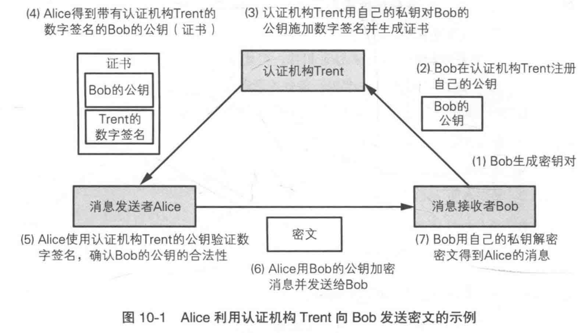

# 加解密技术简介

在我们完全对加解密不了解的时候，如何进行文本加密？最常用的方式，就是把文本顺序打乱。在计算机出现之前，这种方式或许比较有用，但从今天看来，这种方式没有丝毫安全可言。

在计算机的高密度运算的今天，再繁琐的加密步骤也阻挡不了破解，因此，在计算机中的加解密算法都是公开的，将复杂度集中在密钥的不可破解上。

## 单项散列函数

单项散列函数的应用比较常见，就是hash值，加密比较常用的是md5和sha1算法。说白了，就是对一组数据进行计算，找到能够唯一代表它的值，就好比给世界万物标识一个身份ID。这组数据一旦发生改动，hash值也会随之改变。

单项散列函数的基本原理：

拿一个字符来举例`abcd`，对应的ASCII码值为`97 98 99 100`，将其值相加得`394`，这个值能代表`abcd`吗？肯定不能的，因为字符串的排列`dcba`、`dabc`等相加值都是`394`。加入一个散列值对应多个源数据，那么就发生了碰撞，意味着`这个散列值算法`不好。

md5、sha1还有其他散列算法，都是用不同的计算方式来解决碰撞冲突问题。具体的算法步骤相对复杂，有兴趣可以找相关资料。

单项散列函数的特点：

1. 固定长度。无论被加密的数据有多长，加密后长度是固定的，常见的md5就是32个字符串。
2. 不可逆。通过散列值无法推导出原始数据。
3. 无密钥，公开，也就说，有原始数据，谁都可以计算出相同的散列值。

> 严格来说，单项散列算法不能算加密算法，因为加密后不包含原始数据。

不过，通过彩虹表倒推原始数据（假如不存在碰撞冲突的话），有点儿高压缩方案的意思。

## 单项散列函数的应用

既然散列值能唯一代表一组数据，它就可以作为一个身份标识，防止数据篡改。

最常用的场景就是客户端与服务端之间的数据传输了，客户端给服务端发送了一段报文：

```json
{
	method: '/getUserInfo'
	args: {
		mobile: '13433443333',
		//...
	}
}
```

假设这段报文被他人获取，并篡改其手机号码，然后发给服务端，可能会造成客户信息的丢失。为了防止他人进行数据篡改，可以在报文中加一个散列值，这个值是对`args`参数的散列`summary`：


```json
{
	method: '/getUserInfo'
	args: {
		mobile: '13433443333',
		//...
	},
	
	summary: 'xxxxxx'
}
```

当`args`参数被篡改后，服务端对args的散列计算和传递过来的`summary`值会不一致，服务端认为该报文不可信任。

> 你可能会问，如果篡改者同时也修改了summary的值怎么办？这是后面需要解决的。

这种应用就叫`消息摘要`，summary是对args报文的摘要，用来防止数据篡改。

## 数字签名

现在我们要解决上面`summary`被篡改的问题。

这时候就需要用到其他的加密技术，比如AES或RSA，具体使用方式，就是对我们的消息摘要进行加密。这次更换一下关键词，将`summary`改为`sign`:

```json
{
	method: '/getUserInfo'
	args: {
		mobile: '13433443333',
		//...
	},
	
	sign: 'AEDSMFDPXXX'
}
```

`AEDSMFDPXXX`是对消息摘要进行加密后的值。这有什么用呢？他人依然可以篡改args并把篡改后的args的摘要值替换`sign`，但是篡改者没有对sign值进行加密，因为他不知道我们的密钥就无法正确加密。这样服务端收到数据后，先对sign进行解密，并将解密后的摘要值与自己计算args的摘要值比对，一致才算合法请求。

很明显，由于篡改者无法正确的对sign值进行加密，所以他篡改数据就不会成功。对消息进行摘要，并对摘要进行加密（不是传输数据加密）处理的方法，被称为`数字签名`。

具体AES和RSA是什么加密方式，它们之间有什么区别，请看下一章节。

## 对称加密与非对称加密

AES属于对称加密，简单理解，对称加密就是客户端与服务端共享一个密钥：`客户用密钥加密，服务端用密钥解密，反之亦然`。

对称加密，所有的安全性都保证在密钥不泄露，一旦密钥被窃，数据的安全性就没有保证了。

RSA属于非对称加密，也就是有两个密钥：`公钥`和`私钥`。一般客户端保存公钥，用它对数据加密，发送到服务端，服务端保存有私钥，用它将客户端发来的数据解密。

为什么要两个密钥？当然是有好处的，假如你用公钥加密了一组数据，不小心把公钥泄露了，得到你公钥的人无法解密你的数据。只有用私钥才能解密用公钥加密的数据，这就进一步保证了数据的安全性。

非对称加密更安全可靠，唯一的缺点就是性能比对称加密差好几个等量级，所以RSA的应用场景只针对短数据加密，不会针对整个报文，比如对用户密码，以及上面提到的对摘要信息进行加密。

RSA解决不了整个报文是明文的问题（因为对整个报文进行RSA加密性能代价太大），消息摘要只是防止报文被篡改，对称加密才是解决报文明文的的问题。

## 数字证书

互联网的发展离不开数字证书，现在数字证书随处可见，最常见的就是浏览器对数字证书做校验，凡是通过浏览器证书校验的，都会进行绿色通行标识：


HTTPS就需要用到数字证书，那什么是数字证书呢？

我们先看下数字签名的缺陷：假如你不小心打开一个假冒网站（和真网站一模一样），它给你分配了一个公钥，于是你照常操作，使用公钥与假网站交互，整个过程都没有任何不对的地方，唯一有问题的地方就是可能你的银行账户和密码被盗了。

也就是说使用数字签名的前提是彼此信任，针对网站这种多对多的公开场景（多网站对多个人），显然数字签名是可以假冒的。

针对这个问题，就出来一个中心信任机构（他家都信他），由它来给大家颁发证书，只有它颁发的证书才是可信的。证书机构具体如何颁发呢，首先你将自己的公钥给它，它用自己的私钥对你的公钥进行加密作为数字签名，再和你的公钥打包，就做成了一张数字证书。（两对密钥，你自己的公私钥，证书机构的公私钥）

交互过程看下图：


<center>图片来源于互联网</center>


详细流程介绍可以这篇教程：[数字签名是什么](http://www.ruanyifeng.com/blog/2011/08/what_is_a_digital_signature.html)


## 随机数的重要性

回想下很多人银行密码被盗的案例，被盗的原因不是设置的密码太简单，而是有规律，被猜出来了，比如使用自己或家人的生日作为密码，熟悉你的人只要多尝试几次就可以试出来。

这说明什么问题呢？

无论对称加密还是非对称加密，总归是要有密钥的，那么密钥就相当与你的密码，如果产生密钥的过程比较有规律的话，那密码的安全性就大打折扣。好么，我们程序员干的事儿就是让事情井然有序，而密码学却反着来。对计算机来说，基本都是井然有序的，要找出无规律的因子还真不容易。

对于密码学来说，`是否可预测`很重要，它是加密安全强度的基石。

随机数就是用来产生不规律的技术手段，所以密码学离不开随机数。但是计算机系统的随机数也是由软件生成的，那么它天然性`不那么真正的随机`，因此大家都叫它伪随机数。那么怎么才不是伪随机呢，靠专门的硬件产生的才是真随机数。

我们常用的系统提供的随机函数都是伪随机数，也就是说它不那么`安全`，不那么安全仅仅针对与密码学来说，如果我们采用随机数用于处理业务逻辑，是没有问题的。如果用于加密算法，则需要采用系统专门提供的安全随机数函数，它的原理是通过外部噪音实现，如硬件中断。

## 异或与加密

计算机的异或操作（XOR）有个很大的特性：

```
A | B = C  //加密
C | B = A  //解密
```

假如把A看做明文，B是密钥，C就是明文A加密后的结果。把密文C和密钥B进行异或运算，即可还原明文A。有没有一点小兴奋？异或操作具有天然的加解密特性。另外异或操作属于原子操作，性能也比较好，因此在数据运算过程中使用比较多。

## 质数与加密

凡是计算复杂度高的地方都会有质数的身影。为什么？

原因其实很简单：`两个质数的乘积为合数，通过乘积的合数反推两个质数非常困难。`困难的原因是，没有现成推导公式可以直接计算是哪两个质数，目前的计算手段非常low，不用说你也明白：`穷举`。如果给一个几百位的合数，把计算机累死也穷举不过来。

```
质数 * 质数 = 合数

合数 = ? * ?
```

因此，质数在密码学中占有很重要的地位。如果有一天你可以推导出合数的质数因子公式，整个世界将为你而改变。


