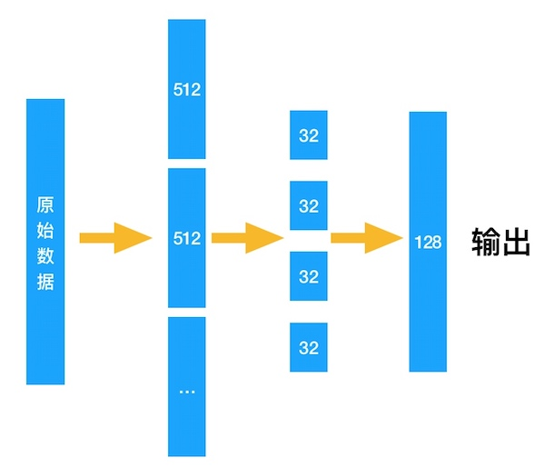

# 单向散列算法简介

介绍常见的单向散列算法，以及他们之间的区别。

## md5

md5是最常见的一种单向散列算法，早期应用较多，目前使用逐渐减少，被更安全的算法所替代。事实上，在md5之前还有md2、md3、md4，安全相关算法随着计算机运算能力的发展，以及互联网迅速发展对更高安全的需求，不断再革新。

md5的值长这个样子：

```
a016f16a5a7215768936a1626f40ca6b
```

长度是32位的字符串。也许你还听说过16位、128位的md5，具体是什么情况，它们之间有什么关系呢？

在加密学中说到的`位`指的是`bit`单位，md5是128位加密的。而加密出来的结果，对于我们来说看到的是字符串，这个字符串的长度是32位，实际它是用十六进制字符串表示的结果，十六进制一个字符代表二进制的4`bit`。

那长度为16的md5又是怎么回事儿？实际上16位的md5是从32位中截取出来的，仅仅是为了表达方便。

为什么输出长度是固定的呢，跟算法相关，把原始数据按照512位分组，再做运算和转换为4组32位长度块拼装起来就是128位了，具体算法细节有兴趣可以找资料了解下。

算法实现其实不难，难的地方在于：为什么这样运算和处理就能减少碰撞？据说，深陷到算法细节出不来的人，最终都搞数学去了。




再总结一下：加密算法中的位都是`bit`，并且运算结果都是二进制，为了方便阅读和传输，都会把结果表达成十六进制字符串的形式。

## SHA

也许你使用过sha1，对于使用者来说，和使用md5没什么区别。

SHA即Secure Hash Algorithm（安全散列算法）。也许你已经猜到了，既然叫安全散列意味着，用来替代不安全散列算法的，对，它就是用来md5的。

SHA分`SHA1和SHA2`，SHA2又分：`SHA-224、SHA-256、SHA-384，和SHA-512`。

觉得好麻烦？其实还好，可以这么理解：因为发现md5其实不那么安全，于是发明了SHA1，后来被打脸，SHA1也不那么安全，又发明了SHA-256。后来一想，过几年SHA-256是不是也会不安全，干脆再弄个SHA-512，这下彻底安全了。

SHA-224和SHA-384又是怎么回事，它们就和md5的16位长度截取一样，分别是从SHA-256和SHA-512的简短版本。

> 这里描述的并不严谨，目的是为了容易理解。

从这里面我们会发现一个现象：长度越长的加密就越安全。那么实际应用中，到底用哪个呢？一般场景，如：校验报文有没有被篡改，校验文件有没有被篡改，md5和sha1都够用，如果应用到支付、金融等钱相关的，最好使用SHA-256，至于SHA-512，目前基本用不上。

> sha1是160位加密算法

## python中的库

python3中自带加密库`hashlib`，包含上述相关算法。

```python
//首先导入hashlib库
import hashlib

//简单起见拿个字符串来验证
a = b'hello world.'
```

md5:

```python
In [7]: hashlib.md5(a).hexdigest()
Out[7]: '5eb63bbbe01eeed093cb22bb8f5acdc3'
```

sha1:

```python
In [9]: hashlib.sha1(a).hexdigest()
Out[9]: '2aae6c35c94fcfb415dbe95f408b9ce91ee846ed'
```

sha-256:

```python
In [10]: hashlib.sha256(a).hexdigest()
Out[10]: 'b94d27b9934d3e08a52e52d7da7dabfac484efe37a5380ee9088f7ace2efcde9'
```

sha-224:

```python
In [12]: hashlib.sha224(a).hexdigest()
Out[12]: '2f05477fc24bb4faefd86517156dafdecec45b8ad3cf2522a563582b'
```

sha-384:

```python
In [13]: hashlib.sha384(a).hexdigest()
Out[13]: 'fdbd8e75a67f29f701a4e040385e2e23986303ea10239211af907fcbb83578b3e417cb71ce646efd0819dd8c088de1bd'
```

sha-512:

```python
In [14]: hashlib.sha512(a).hexdigest()
Out[14]: '309ecc489c12d6eb4cc40f50c902f2b4d0ed77ee511a7c7a9bcd3ca86d4cd86f989dd35bc5ff499670da34255b45b0cfd830e81f605dcf7dc5542e93ae9cd76f'
```

可以看到sha-512输出太长了，实际应用不需要这么高密度的算法。


## 为什么要用它们

也许你会有这样的想法：为什么要用md5和sha呢，语言库中天然就带有hash函数，都是单向散列，不都一样吗。

md5和程序库的hash最主要区别在于：md5等算法是标准，全球通用，程序库中的hash只认自个儿，换个平台或库就不通用了。


