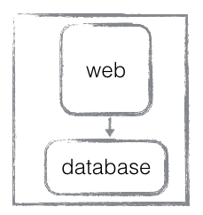
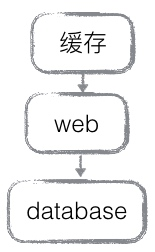
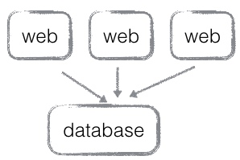
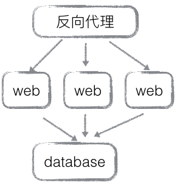
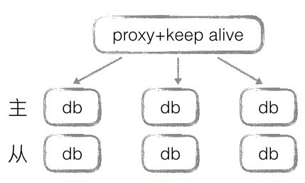
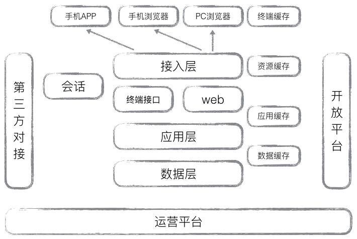

# 后端架构演变

## 前言
看到很多人对服务端架构理解有些吃力，个人认为学习服务端架构跟学习一门新的语言差不多，感觉吃力肯定是学习方法的问题。任何事物的发展都有一个演变过程，而最初阶段是最容易理解的，然后再看看是何因素导致发展和演变，那么整体脉络自然清晰可见。同时，对于架构选择，如何避免陷阱也有很大帮助。

> 更新，看到一片同类型的文章，比我写的好
> http://www.hollischuang.com/archives/728

## web的浏览


```
服务端最初呢，没有前后端的区分，没有数据库，只有静态资源（HTML），用户只是通过浏览器浏览文字和图片。
```

## web的交互



```
有一天，用户想发表评论，服务端想记住不同的用户，记住每个用户的购物习惯，做推荐等……总之，用户与服务交互的需求来临。这时，数据与展示实现分离。
```

从全局的功能架构上来说，架构演变完毕，发展到今天依然未变。

## 总结
现在开始总结……
等等，如今各种繁杂的后端架构，各种技术层出不穷，怎么会这么简单？

其实很好理解，用户需求分为功能性需求和非功能性需求，后续的各种演变基本都是针对非功能性需求（如果不清楚功能性需求和非功能性需求请百度之）。

实际情况当然没这么简单，但把握主干因素，更易于我们的理解，而且把握主干因素后面的路不会走偏。

## 技术架构演变
最大的一个演变原因是并发，简单理解就是用户数的上升。

我们建设了一个网站，很受用户欢迎，开始很好，随着人数上升，服务器撑不住了，开始卡顿，开始报错，开始瘫痪……

怎么解决？

* 缓存：



```	
缓存原理：1、用户频繁访问少部分资源，将这部分资源放入内存中；2、内存访问比磁盘访问性能高很多；
```

* 优化web服务性能

```	
使用多进程、多线程、异步IO等多种技术手段提高服务性能，提高单台web服务的能力（受硬件制约）。
```

经过优化，能处理的用户访问提高了一大截，但网站做的太好了，用户量还在持续上升，新的瓶颈迟早到来，必须提前想解决方案了。

## 一劳永逸的解决方案？
用户越多，web接入和处理能力就要越强，现实是残酷的，单台物理服务器能力总会有上限。

单台不行只能多台喽，还有什么好说的。



```
当web服务支撑不足时，就增加一台web服务，再不足时，再增加一台，如此循环……
```

很好的解决方案，不是吗，只要有足够的服务器就能支撑无尽的用户（大部分时候硬件成本要比软件成本更便宜）。

这里只是有个小问题：网站的域名只有一个，而且已经上线深入人心，更改域名是不可行的，那么如何把一个域名映射到多个web服务，是迫切需要解决的。

这个也不难，给域名绑定多个IP。最后一打听，公网IP太TM贵了，买不起，怎么办？。
好吧，那我们用反向代理来解决吧。



```
你不知道反向代理？不，你肯定知道，给你举个例子：apache，nginx。
那一溜儿web服务堆在一块有个名词叫集群，因为每个web都干同样的事儿，没差别。
```

这下没问题了，我们的网站运行的很好，用户翻倍了，增加web服务器，改一下反向代理配置就搞定了。接下来干什么？当然是喝喝咖啡，找妹纸聊聊天啦……

## 新的事端
一个月后，咖啡喝吐了，聊天也没新鲜感了，正想着要不要退休呢……突然线上出故障了。

是这样的，用户打开我们的网站还能浏览，但是超慢，办理业务基本不可用。
经过定位，发现问题出在数据库上，web服务处理能力没问题，但数据库承受不住了，赶快联系数据库厂商，他们有成熟的解决方案，什么?license按核收费？有没有天理了。

## 数据库集群
数据库更换成了开源数据库，水平拆分+主从备份，一段儿时间内可以支撑了。



但是随着业务的扩充，随着信息化时代的发展，数据量几何倍数增长，关系型数据库在处理大数据方面渐渐难以满足需求，开始储备Nosql技术吧。

## 发展
网站发展蒸蒸日上，设计需要重构优化了，需要开发新业务，需要开放一部分能力，需要对接第三方业务，现在移动互联网比较火，要支持终端触屏及app，要做大数据，做用户画像，精准推送等等等等……一切一切来源于变化。



当一个系统变得很大时，无论业务复杂度和技术复杂度都会变得不可维护，目前的后端技术除了解决性能问题，还要解决业务复杂性，实现解耦可维护。

还好，现在的开源项目越来越多，每个层次都有开放的组件和框架，我们需要做的就是抉择。

* 根据公司性质，选择团队组织模式，开发流程
* 根据项目需求，建立领域模型，选择架构模式
* 根据公司技术实力，选择技术产品
* 根据公司技术人员构成，选择开发语言

## 非功能性需求的无穷无尽

不长篇大论了，非功能性需求之间通常带有互斥性，提升这个可能会对其他需求造成负面影响，再加上功能需求变更，导致项目才会越来越复杂，越来越难以维护。


